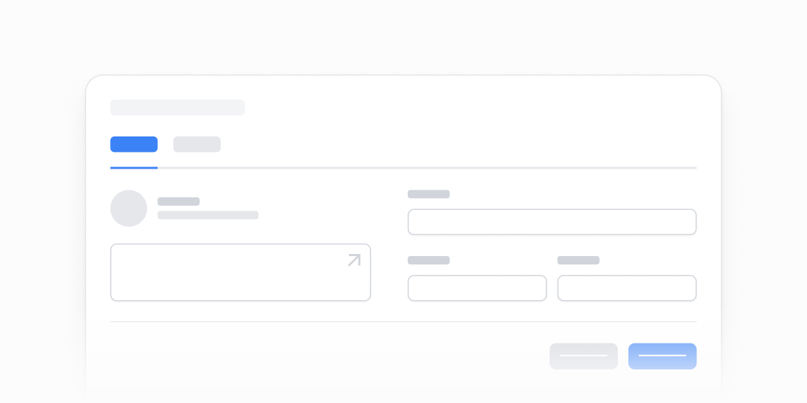

# Hisob va foydalanuvchilar — 15 ta blok

[← Toʻplam](../README.md) · papka: [`bloklar/account-and-user-management/`](../bloklar/account-and-user-management/)

Sozlamalar sahifalari: hisob formasi, funksiya Switchʼlari, add-onʼlar, foydalanuvchilar jadvali/roʻyxati, taklif qilish, rollar, audit boʻlimlari.

**Ustozonaʼda:** Admin `users`: 08 (taklif + qidiruv + rol filtri + jadval), 13/14 (rolni joyida oʻzgartirish). `audit`: 15 (Accordion audit boʻlimlari).

**Primitivlar** (nechta blokda): `Button` (14), `Divider` (10), `Tabs` (10), `Label` (8), `Input` (7), `Select` (6), `Card` (3), `Switch` (3), `Table` (3), `Checkbox` (2), `DropdownMenu` (1), `Tooltip` (1), `Accordion` (1).

**Toʻsiqlar:** yoʻq — ikon va `tailwind-variants` almashtirilsa, loyiha paketlari bilan tip xatosiz.

| # | Koʻrinish | Primitivlar | Toʻsiq |
|---|---|---|---|
| [01](../bloklar/account-and-user-management/account-and-user-management-01.tsx) | Sozlamalar tablari + email va hisob formasi | Button, Divider, Input, Label, Tabs | — |
| [02](../bloklar/account-and-user-management/account-and-user-management-02.tsx) | Workspace sozlamalari: Switchʼli funksiya kartochkalari | Card, Button, Divider, Label, Switch, Tabs | — |
| [03](../bloklar/account-and-user-management/account-and-user-management-03.tsx) | Add-on kartalari: narx, tavsif, Switch bilan yoqish | Card, Button, Divider, Label, Switch, Tabs | — |
| [04](../bloklar/account-and-user-management/account-and-user-management-04.tsx) | 03 ning bitta kartali varianti | Card, Button, Divider, Label, Switch, Tabs | — |
| [05](../bloklar/account-and-user-management/account-and-user-management-05.tsx) | Bepul tarif banneri + nom (disabled), standart model Select va boshqa sozlamalar | Button, Checkbox, Divider, Input, Label, Select, Tabs | — |
| [06](../bloklar/account-and-user-management/account-and-user-management-06.tsx) | Foydalanuvchilar jadvali (aʼzo, email, rol, Edit) + «Add user» | Button, Table, Tabs | — |
| [07](../bloklar/account-and-user-management/account-and-user-management-07.tsx) | Foydalanuvchilar roʻyxati (initsial, ism, email, Edit) | Button, Tabs | — |
| [08](../bloklar/account-and-user-management/account-and-user-management-08.tsx) | Taklif (rol + email) + tablar: mavjud foydalanuvchilar (qidiruv, rol filtri, jadval) / kutilayotgan takliflar | Button, Divider, Input, Select, Table, Tabs | — |
| [09](../bloklar/account-and-user-management/account-and-user-management-09.tsx) | 08 ning tabsiz varianti | Button, Divider, Input, Select, Table, Tabs | — |
| [10](../bloklar/account-and-user-management/account-and-user-management-10.tsx) | Workspace yaratish: nom, aʼzolar emailʼi, qoʻshilganlar roʻyxati | Button, Divider, Input, Label | — |
| [11](../bloklar/account-and-user-management/account-and-user-management-11.tsx) | Hisob maʼlumotlari formasi (ism, email, manzil) + bildirishnoma sozlamalari | Button, Checkbox, Divider, Input, Label | — |
| [12](../bloklar/account-and-user-management/account-and-user-management-12.tsx) | Aʼzolarni taklif qilish: mavjud kirish huquqi + kutilayotgan takliflar | Button, Input, Select | — |
| [13](../bloklar/account-and-user-management/account-and-user-management-13.tsx) | Aʼzolar roʻyxati: har birida rol Selectʼi va oʻchirish; kutilayotgan takliflar | Button, Divider, Label, Select, Tabs | — |
| [14](../bloklar/account-and-user-management/account-and-user-management-14.tsx) | Rol Selectʼi (admin — Tooltip bilan bloklangan), «Add user» | Button, DropdownMenu, Select, Tooltip | — |
| [15](../bloklar/account-and-user-management/account-and-user-management-15.tsx) | Audit boʻlimlari Accordionʼda: holat + progress (3/5), audit sanalari, hujjatlar | Accordion | — |
