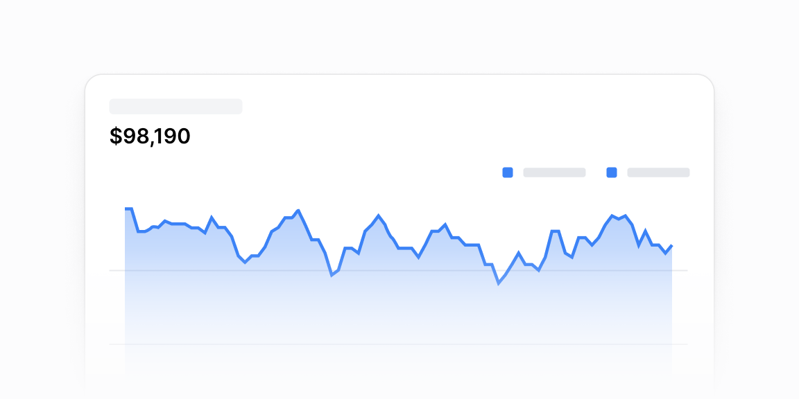

# Area grafiklar — 16 ta blok

[← Toʻplam](../README.md) · papka: [`bloklar/area-charts/`](../bloklar/area-charts/)

Toʻldirilgan chiziqli (area) grafik kartalari: legenda-jamlar, taklif bannerlari, tablar, monitoring. Deyarli hammasi **ikkita** grafik chizadi — `sm` dan kattada Y-oʻqli, mobilda Y-oʻqsiz `startEndOnly` (responsiv naqsh).

**Ustozonaʼda:** Davomat va baho trendi (`AttendanceTrendCard`): 06 — joriy vs oʻtgan davr, 07 — kursor ostidagi oy + oldingi oyga nisbatan oʻzgarish. Admin: 09/13 — tabli metrikalar.

**Primitivlar** (nechta blokda): `AreaChart` (15), `Card` (14), `Tabs` (5), `Button` (3), `Divider` (1).

**Toʻsiqlar:** recharts 3 — 16 — maʼnosi: [README, «Toʻsiq belgilari»](../README.md#toʻsiq-belgilari).

| # | Koʻrinish | Primitivlar | Toʻsiq |
|---|---|---|---|
| [01](../bloklar/area-charts/area-chart-01.tsx) | Ikki seriyali (Organic / Sponsored) area grafik, ostida legenda va har seriya jami | Card, AreaChart | recharts 3 |
| [02](../bloklar/area-charts/area-chart-02.tsx) | 01 + grafik ostida yopiladigan «Upgrade» taklif satri | Card, AreaChart, Button | recharts 3 |
| [03](../bloklar/area-charts/area-chart-03.tsx) | 01 + grafik ustida yopiladigan «Free trial» taklif kartochkasi | Card, AreaChart, Button | recharts 3 |
| [04](../bloklar/area-charts/area-chart-04.tsx) | Kumulyativ koʻrsatkich: katta raqam, area grafik va ustida yopiladigan izoh-kartochka («Significant increase») | Card, AreaChart, Button | recharts 3 |
| [05](../bloklar/area-charts/area-chart-05.tsx) | Balans: katta raqam, area grafik, pastda «Team access» va ikki tashqi havola | Card, AreaChart | recharts 3 |
| [06](../bloklar/area-charts/area-chart-06.tsx) | Daromad + % nishoni, «joriy yil vs oʻtgan yil» — ikki seriya, legendada jamlar | Card, AreaChart, Divider | recharts 3 |
| [07](../bloklar/area-charts/area-chart-07.tsx) | Interaktiv: kursor ostidagi oy qiymati va oldingi oyga nisbatan oʻzgarish (%, mutlaq) tepada chiqadi | Card, AreaChart | recharts 3 |
| [08](../bloklar/area-charts/area-chart-08.tsx) | Hudud tablari (ogohlantirish soni bilan); tab ichida area grafik + havola-kartochka ogohlantirishlar | Card, AreaChart, Tabs | recharts 3 |
| [09](../bloklar/area-charts/area-chart-09.tsx) | Daromad + area grafik; ostida tablar (kanal / mahsulot) — ▲/▼ reyting, ulush va jami | Card, AreaChart, Tabs | recharts 3 |
| [10](../bloklar/area-charts/area-chart-10.tsx) | Monitoring: muvaffaqiyatli / xato soʻrovlar (koʻk / qizil) + «Success rate» nishoni | Card, AreaChart | recharts 3 |
| [11](../bloklar/area-charts/area-chart-11.tsx) | 10 varianti: legenda katta raqamlar bilan, success-rate nishonisiz | Card, AreaChart | recharts 3 |
| [12](../bloklar/area-charts/area-chart-12.tsx) | 11 + davr tablari (mobilda tepaga koʻchadi) | Card, AreaChart, Tabs | recharts 3 |
| [13](../bloklar/area-charts/area-chart-13.tsx) | Metrika toʻplamlari tablari: har tabda oʻz legenda-jamlari, ranglari va formatteri | Card, AreaChart, Tabs | recharts 3 |
| [14](../bloklar/area-charts/area-chart-14.tsx) | 13 + «Success rate» nishoni | Card, AreaChart, Tabs | recharts 3 |
| [15](../bloklar/area-charts/area-chart-15.tsx) | Kartasiz: «Actual vs potential costs» — legendada jamlar, ikki seriya | AreaChart | recharts 3 |
| [16](../bloklar/area-charts/area-chart-16.tsx) | Kartasiz, bitta seriya + tushuntirish matni; AreaChart primitivining **moslangan nusxasi fayl ichida** (1100+ qator) | — | recharts 3 |
