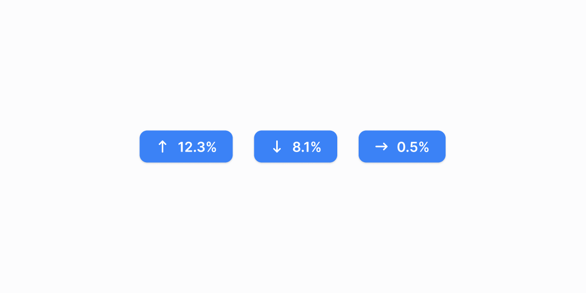

# Nishonlar (badge) — 13 ta blok

[← Toʻplam](../README.md) · papka: [`bloklar/badges/`](../bloklar/badges/)

Oʻzgarish nishonlari (▲▼►), holat + oʻzgarish, filtr «chip»lari (×), ikonli holatlar, avatarli, havolali va bosqichli nishonlar. Primitivsiz — faqat `span`.

**Ustozonaʼda:** 01–04 — delta nishoni (`StatCard` da bor), 06/07 — faol filtr chiplari (statistika filtrlari), 05 — holat + oʻzgarish.

**Primitivlar** (nechta blokda): yoʻq — faqat xom HTML.

**Toʻsiqlar:** yoʻq — ikon va `tailwind-variants` almashtirilsa, loyiha paketlari bilan tip xatosiz.

| # | Koʻrinish | Primitivlar | Toʻsiq |
|---|---|---|---|
| [01](../bloklar/badges/badge-01.tsx) | Oʻzgarish nishonlari ▲▼► (toʻldirilgan strelka) — yashil / qizil / kulrang | — | — |
| [02](../bloklar/badges/badge-02.tsx) | Chiziqli strelka bilan | — | — |
| [03](../bloklar/badges/badge-03.tsx) | 02 ning boshqa fonli varianti | — | — |
| [04](../bloklar/badges/badge-04.tsx) | Ikki qismli: qiymat + rangli strelka bloki | — | — |
| [05](../bloklar/badges/badge-05.tsx) | Holat + oʻzgarish («In progress +5.1%») | — | — |
| [06](../bloklar/badges/badge-06.tsx) | Filtr chiplari: kalit | qiymat + × | — | — |
| [07](../bloklar/badges/badge-07.tsx) | 06 varianti | — | — |
| [08](../bloklar/badges/badge-08.tsx) | Ikonli holat nishonlari (kalit + qiymat) | — | — |
| [09](../bloklar/badges/badge-09.tsx) | Avatarli nishonlar (rasm + ism) | — | — |
| [10](../bloklar/badges/badge-10.tsx) | 09 + × tugmasi | — | — |
| [11](../bloklar/badges/badge-11.tsx) | Havolali nishonlar (hodisa → Updates, Connected · Edit, bildirishnoma) | — | — |
| [12](../bloklar/badges/badge-12.tsx) | Bosqichlar ketma-ketligi (Deploy → Preview → Ship) | — | — |
| [13](../bloklar/badges/badge-13.tsx) | Ikon + yorliq qadamlari | — | — |
