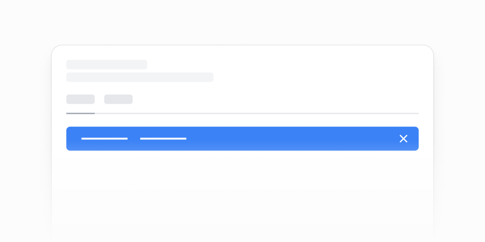

# Bannerlar — 5 ta blok

[← Toʻplam](../README.md) · papka: [`bloklar/banners/`](../bloklar/banners/)

Yopiladigan xush kelibsiz / birinchi qadam bannerlari (demoʼda yopilgach 1 soniyadan keyin qayta ochiladi).

**Ustozonaʼda:** Yangi foydalanuvchi uchun dashboard bannerlari; loyihada `ui/inline-banner` bor.

**Primitivlar** (nechta blokda): `Button` (5), `Card` (5).

**Toʻsiqlar:** yoʻq — ikon va `tailwind-variants` almashtirilsa, loyiha paketlari bilan tip xatosiz.

| # | Koʻrinish | Primitivlar | Toʻsiq |
|---|---|---|---|
| [01](../bloklar/banners/banner-01.tsx) | Yopiladigan xush kelibsiz banneri (qoʻllanma havolalari) | Card, Button | — |
| [02](../bloklar/banners/banner-02.tsx) | 01 + ikonli resurs havolalari | Card, Button | — |
| [03](../bloklar/banners/banner-03.tsx) | Qadamlar bilan xush kelibsiz banneri | Card, Button | — |
| [04](../bloklar/banners/banner-04.tsx) | 03 varianti | Card, Button | — |
| [05](../bloklar/banners/banner-05.tsx) | «Birinchi dashboardʼni yarating» banneri | Card, Button | — |
