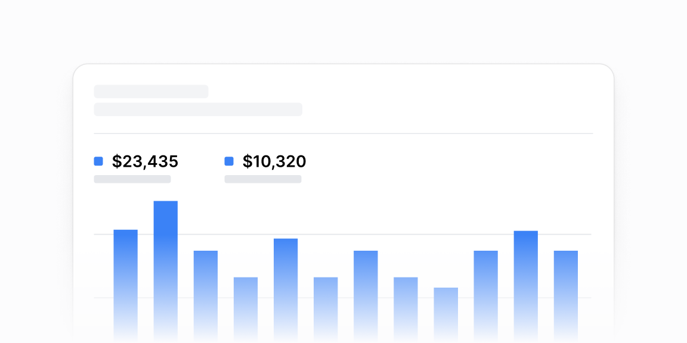

# Bar grafiklar — 12 ta blok

[← Toʻplam](../README.md) · papka: [`bloklar/bar-charts/`](../bloklar/bar-charts/)

Ustunli grafiklar: solishtirish (Switch), stacked, foizli, tabli, interaktiv (bosilganda raqam yangilanadi), sinxron mini-grafiklar.

**Ustozonaʼda:** 01/03 — shu yil vs oʻtgan yil (chorak, oy); 12 — foizli stacked (bajarilgan / bajarilmagan); 10 — adminʼda bir nechta sinxron metrika (roʻyxatdan oʻtish, faol foydalanuvchi).

**Primitivlar** (nechta blokda): `BarChart` (10), `Card` (8), `Tabs` (3), `Divider` (1), `Label` (1), `Switch` (1), `RadioCardGroup` (1).

**Toʻsiqlar:** recharts 3 — 12, react-countup — 1 — maʼnosi: [README, «Toʻsiq belgilari»](../README.md#toʻsiq-belgilari).

| # | Koʻrinish | Primitivlar | Toʻsiq |
|---|---|---|---|
| [01](../bloklar/bar-charts/bar-chart-01.tsx) | Sotuv sharhi; Switch bilan «oʻtgan yilning shu davri» seriyasini yoqish | Card, BarChart, Divider, Label, Switch | recharts 3 |
| [02](../bloklar/bar-charts/bar-chart-02.tsx) | 3 hudud boʻyicha stacked bar + tepada hudud jamlari | Card, BarChart | recharts 3 |
| [03](../bloklar/bar-charts/bar-chart-03.tsx) | Bu yil vs oʻtgan yil guruhlangan bar + legenda (qiymat, % oʻzgarish) | Card, BarChart | recharts 3 |
| [04](../bloklar/bar-charts/bar-chart-04.tsx) | Tab triggerida hudud, jami va oʻzgarish; ichida stacked bar (3 holat) + tafsilot roʻyxati | Card, BarChart, Tabs | recharts 3 |
| [05](../bloklar/bar-charts/bar-chart-05.tsx) | 04 ning oddiy tab triggerli varianti | Card, BarChart, Tabs | recharts 3 |
| [06](../bloklar/bar-charts/bar-chart-06.tsx) | RadioCardGroup bilan hudud tanlanadi (kartada qiymat) → grafik shu hududga almashadi | BarChart, RadioCardGroup | recharts 3 |
| [07](../bloklar/bar-charts/bar-chart-07.tsx) | Bar yoki legenda bosilsa tepadagi raqam CountUp animatsiyasi bilan yangilanadi | BarChart | recharts 3, react-countup |
| [08](../bloklar/bar-charts/bar-chart-08.tsx) | Soʻrovlar: legenda-jamlar + stacked bar (muvaffaqiyatli / xato), «Learn more» | Card, BarChart | recharts 3 |
| [09](../bloklar/bar-charts/bar-chart-09.tsx) | 08 + loyiha tablari va «Updated just now» holat nuqtasi | Card, BarChart, Tabs | recharts 3 |
| [10](../bloklar/bar-charts/bar-chart-10.tsx) | Uchta sinxron (`syncId`) mini bar grafik — hover biriga tushsa hammasida; BarChart fayl ichida moslangan | Card | recharts 3 |
| [11](../bloklar/bar-charts/bar-chart-11.tsx) | Chegaraga qarab ranglanadigan bar (past / yuqori), custom tooltip, Y-oʻq yorligʻi; BarChart fayl ichida moslangan | — | recharts 3 |
| [12](../bloklar/bar-charts/bar-chart-12.tsx) | Foizli stacked bar (`type="percent"`), custom tooltip, Y-oʻq yorligʻi | BarChart | recharts 3 |
