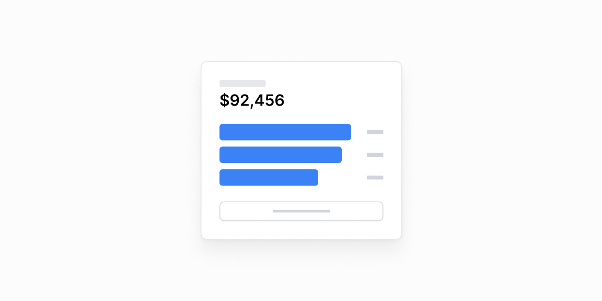

# Bar roʻyxatlar — 7 ta blok

[← Toʻplam](../README.md) · papka: [`bloklar/bar-lists/`](../bloklar/bar-lists/)

Gorizontal bar roʻyxat (BarList): top-N + «Show more» dialogi (qidiruv bilan), tablar, bosilganda filtrlash.

**Ustozonaʼda:** Eng koʻp qoldirgan oʻquvchilar (`AbsenceTierList`), mavzular boʻyicha oʻzlashtirish, adminʼda eng faol maktablar. 02 — top-5 + qidiruvli toʻliq roʻyxat.

**Primitivlar** (nechta blokda): `Card` (7), `BarList` (5), `Button` (5), `Dialog` (4), `Input` (4), `ProgressBar` (2), `Tabs` (1).

**Toʻsiqlar:** React 19 — 2, react-countup — 1 — maʼnosi: [README, «Toʻsiq belgilari»](../README.md#toʻsiq-belgilari).

| # | Koʻrinish | Primitivlar | Toʻsiq |
|---|---|---|---|
| [01](../bloklar/bar-lists/bar-list-01.tsx) | «Top pages» BarList + «Show more / less» (roʻyxat joyida kengayadi) | Card, BarList, Button | — |
| [02](../bloklar/bar-lists/bar-list-02.tsx) | Top-5 BarList + «Show more» → Dialog: qidiruv + toʻliq roʻyxat (scroll) | Card, BarList, Button, Dialog, Input | React 19 |
| [03](../bloklar/bar-lists/bar-list-03.tsx) | 02 + tepada jami raqam | Card, BarList, Button, Dialog, Input | React 19 |
| [04](../bloklar/bar-lists/bar-list-04.tsx) | Buyurtmalar: ProgressBar (bajarilgan / ochiq ulushi) + roʻyxat; dialogda qidiruv (BarList emas) | Card, Button, Dialog, Input, ProgressBar | — |
| [05](../bloklar/bar-lists/bar-list-05.tsx) | 04 varianti (legenda nuqtalari bilan) | Card, Button, Dialog, Input, ProgressBar | — |
| [06](../bloklar/bar-lists/bar-list-06.tsx) | Tablar — har tabda BarList | Card, BarList, Tabs | — |
| [07](../bloklar/bar-lists/bar-list-07.tsx) | Qator bosilsa tepadagi raqam CountUp bilan shu qiymatga oʻtadi; tanlov «chip» sifatida olib tashlanadi | Card, BarList | react-countup |
