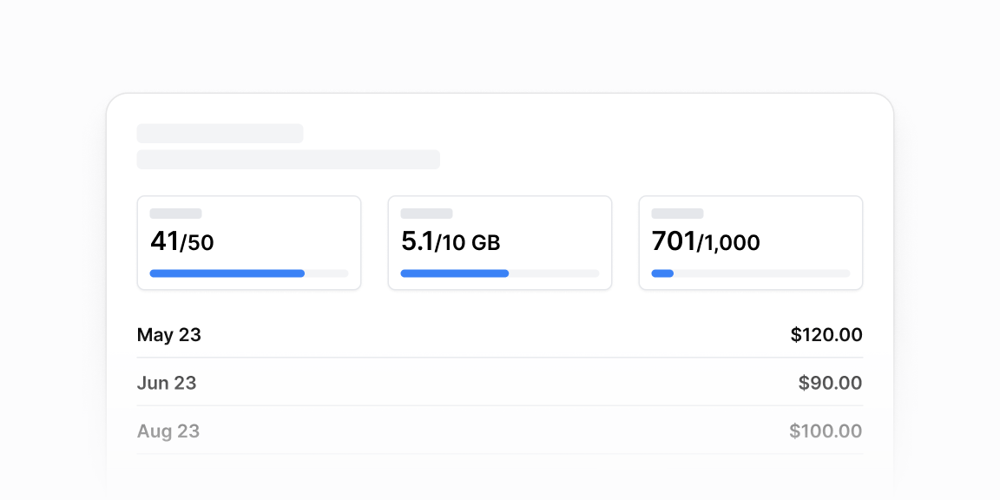

# Hisob va sarf — 10 ta blok

[← Toʻplam](../README.md) · papka: [`bloklar/billing-usage/`](../bloklar/billing-usage/)

Tarif, sarf va toʻlov ekranlari: resurs sarfi kartalari, toʻlov tarixi, oʻrinlar, xarajat taqsimoti, xarajat chegarasi, tarif konfiguratori va kalkulyatorlar.

**Ustozonaʼda:** AI kvota va limitlar sahifasi: 05/06 (sarf taqsimoti ProgressBar bilan), 07 (chegara + Switch), 01 (resurs: ishlatilgan / maksimum).

**Primitivlar** (nechta blokda): `Button` (8), `Tabs` (6), `Card` (5), `Divider` (5), `Input` (4), `Label` (4), `ProgressBar` (3), `Slider` (3), `Table` (2), `ProgressCircle` (2), `Switch` (2), `RadioCardGroup` (1), `RadioGroup` (1), `Select` (1).

**Toʻsiqlar:** yoʻq — ikon va `tailwind-variants` almashtirilsa, loyiha paketlari bilan tip xatosiz.

| # | Koʻrinish | Primitivlar | Toʻsiq |
|---|---|---|---|
| [01](../bloklar/billing-usage/billing-usage-01.tsx) | Sozlamalar tablari + resurs kartochkalari (ishlatilgan / maksimum) | Card, Tabs | — |
| [02](../bloklar/billing-usage/billing-usage-02.tsx) | Upgrade banneri + toʻlovlar tarixi (Receipt havola) + yordam | Button, Tabs | — |
| [03](../bloklar/billing-usage/billing-usage-03.tsx) | Tarif, hisob davri, oʻrinlar (ProgressBar «5 of 25») — har birida boshqaruv tugmasi | Button, Divider, ProgressBar, Tabs | — |
| [04](../bloklar/billing-usage/billing-usage-04.tsx) | Joriy tsikl jadvali (item / qty / unit / price + jami) va toʻlov usuli | Button, Divider, Table, Tabs | — |
| [05](../bloklar/billing-usage/billing-usage-05.tsx) | Xarajat taqsimoti kartasi: nom, qiymat, ProgressBar, sigʻim; oy jami | Card, ProgressBar, Tabs | — |
| [06](../bloklar/billing-usage/billing-usage-06.tsx) | 05 + bepul tarif banneri | Card, Button, Divider, Input, Label, ProgressBar, ProgressCircle, Switch, Tabs | — |
| [07](../bloklar/billing-usage/billing-usage-07.tsx) | Xarajat chegarasi: ProgressCircle ($280 / 350), Switch, limit va email maydonlari | Card, Button, Divider, Input, Label, ProgressCircle, Switch | — |
| [08](../bloklar/billing-usage/billing-usage-08.tsx) | Tarif konfiguratori: Slider bilan qoʻshimcha soʻrovlar, narx hisoblanadi | Button, Divider, Slider, Table | — |
| [09](../bloklar/billing-usage/billing-usage-09.tsx) | Narx kalkulyatori: provayder (RadioCard), hudud, soat Sliderʼi, hajm | Card, Button, Input, Label, RadioCardGroup, RadioGroup, Select, Slider | — |
| [10](../bloklar/billing-usage/billing-usage-10.tsx) | Disk hajmini Slider bilan boʻlimlarga taqsimlash + Apply / Cancel | Button, Input, Label, Slider | — |
