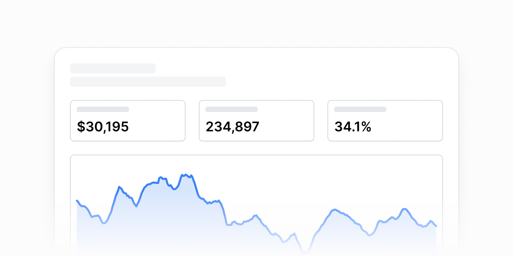

# Grafik kompozitsiyalari — 15 ta blok

[← Toʻplam](../README.md) · papka: [`bloklar/chart-compositions/`](../bloklar/chart-compositions/)

Toʻliq panel/sahifa boʻlaklari: KPI-tab → grafik, grafik + jadval, hisob-kitob sharhi, monitoring sahifasi, bulut metrikalari.

**Ustozonaʼda:** 04/06/13 — tab triggerida KPI, tanlansa grafik almashadi: statistika «Umumiy» boʻlimi va admin dashboard uchun eng yaqin naqsh. 14 — widget kartalar DropdownMenu bilan.

**Primitivlar** (nechta blokda): `Card` (11), `Divider` (8), `AreaChart` (8), `Tabs` (6), `BarChart` (4), `Button` (4), `Table` (3), `CategoryBar` (3), `Badge` (3), `Select` (2), `BarList` (2), `SelectNative` (2), `LineChart` (1), `Dialog` (1), `Input` (1), `Label` (1), `Tooltip` (1), `DropdownMenu` (1), `SparkChart` (1).

**Toʻsiqlar:** recharts 3 — 13, React 19 — 1 — maʼnosi: [README, «Toʻsiq belgilari»](../README.md#toʻsiq-belgilari).

| # | Koʻrinish | Primitivlar | Toʻsiq |
|---|---|---|---|
| [01](../bloklar/chart-compositions/chart-composition-01.tsx) | Portfel: qiymat + oʻzgarish, 3 seriyali chiziq, ostida aktivlar jadvali | LineChart, Table | recharts 3 |
| [02](../bloklar/chart-compositions/chart-composition-02.tsx) | Davr Select + «Overview»: ikki CategoryBar, ikonli statistika roʻyxati, «More info» ostida xulosa | Card, BarChart, CategoryBar, Divider, Select | recharts 3 |
| [03](../bloklar/chart-compositions/chart-composition-03.tsx) | Sahifa + tablar; «Outstanding balance» kartasi: CategoryBar (3 qism) + legenda, toʻlov eslatmasi | Card, CategoryBar, Divider, Table, Tabs | — |
| [04](../bloklar/chart-compositions/chart-composition-04.tsx) | Tab triggerida KPI (nom + qiymat) — tab tanlansa area grafik almashadi | Card, AreaChart, Tabs | recharts 3 |
| [05](../bloklar/chart-compositions/chart-composition-05.tsx) | 04 + tepada sayt nomi, «89 online» jonli nuqta, muhit va davr Selectʼlari | Card, AreaChart, Select, Tabs | recharts 3 |
| [06](../bloklar/chart-compositions/chart-composition-06.tsx) | 04 + grafik ostida kategoriya kartochkalari | Card, AreaChart, BarList, Tabs | recharts 3 |
| [07](../bloklar/chart-compositions/chart-composition-07.tsx) | 06 + kartochkada «Show more» → dialog (qidiruv + BarList) | Card, AreaChart, BarList, Button, Dialog, Input, Tabs | recharts 3, React 19 |
| [08](../bloklar/chart-compositions/chart-composition-08.tsx) | Hisob-kitob sharhi: xulosa qatori, «Active» badge + davr, stacked bar | Badge, BarChart, Divider | recharts 3 |
| [09](../bloklar/chart-compositions/chart-composition-09.tsx) | 08 + davr navigatsiyasi (Previous / Next) | Badge, BarChart, Divider | recharts 3 |
| [10](../bloklar/chart-compositions/chart-composition-10.tsx) | 09 + «Show / Hide details» bilan yigʻiladigan qism | Badge, BarChart, Divider | recharts 3 |
| [11](../bloklar/chart-compositions/chart-composition-11.tsx) | Monitor sahifasi: «Up» holat, amal tugmalari, KPI kartalari, hudud SelectNative + ToggleGroup + grafik | Card, AreaChart, Button, Divider, Label, SelectNative | recharts 3 |
| [12](../bloklar/chart-compositions/chart-composition-12.tsx) | Bir nechta SelectNative filtr + 4 seriyali area grafik | Card, AreaChart, SelectNative, Tooltip | recharts 3 |
| [13](../bloklar/chart-compositions/chart-composition-13.tsx) | Tab triggeri KPI kartochkasi (rang nuqtasi, qiymat, nom) — tanlansa area grafik | Card, AreaChart, Tabs | recharts 3 |
| [14](../bloklar/chart-compositions/chart-composition-14.tsx) | Ikki widget karta (CategoryBar + legenda), har birida DropdownMenu (Edit / Refresh / Delete) | Card, AreaChart, Button, CategoryBar, Divider, DropdownMenu | recharts 3 |
| [15](../bloklar/chart-compositions/chart-composition-15.tsx) | KPI toʻri sparkline bilan, hoverʼda «Edit alarm / View details»; ostida davrlar jadvali | Card, Button, Divider, SparkChart, Table | — |
