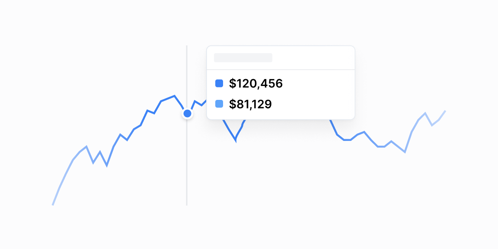

# Grafik tooltipʼlari — 21 ta blok

[← Toʻplam](../README.md) · papka: [`bloklar/chart-tooltips/`](../bloklar/chart-tooltips/)

BarChart uchun 21 xil `customTooltip`. Demo: tooltip statik koʻrsatiladi, «Show Demo» bosilsa grafik ochiladi. Tooltip komponenti fayl ichida `CustomTooltip` deb yozilgan.

**Ustozonaʼda:** 04/05/21 — holatlar boʻyicha % (keldi / kechikdi / kelmadi), 06/11/16 — oldingi davrga nisbatan oʻzgarish, 17 — maqsadga nisbatan bajarilish.

**Primitivlar** (nechta blokda): `BarChart` (21), `Button` (21), `Divider` (21), `ProgressCircle` (3), `DonutChart` (2), `CategoryBar` (1).

**Toʻsiqlar:** recharts 3 — 21 — maʼnosi: [README, «Toʻsiq belgilari»](../README.md#toʻsiq-belgilari).

| # | Koʻrinish | Primitivlar | Toʻsiq |
|---|---|---|---|
| [01](../bloklar/chart-tooltips/chart-tooltip-01.tsx) | Bitta qiymat: rang nuqtasi, kategoriya, qiymat — sarlavhasiz | BarChart, Button, Divider | recharts 3 |
| [02](../bloklar/chart-tooltips/chart-tooltip-02.tsx) | 01 + sana sarlavhasi | BarChart, Button, Divider | recharts 3 |
| [03](../bloklar/chart-tooltips/chart-tooltip-03.tsx) | 02 varianti (sarlavha alohida qatorda) | BarChart, Button, Divider | recharts 3 |
| [04](../bloklar/chart-tooltips/chart-tooltip-04.tsx) | Stacked (3 holat): har holat qiymati va jamiga nisbatan % | BarChart, Button, Divider | recharts 3 |
| [05](../bloklar/chart-tooltips/chart-tooltip-05.tsx) | 04 ning 2 holatli varianti | BarChart, Button, Divider | recharts 3 |
| [06](../bloklar/chart-tooltips/chart-tooltip-06.tsx) | Qiymat + oldingi davrga nisbatan % oʻzgarish | BarChart, Button, Divider | recharts 3 |
| [07](../bloklar/chart-tooltips/chart-tooltip-07.tsx) | 06 ning boshqa joylashuvi | BarChart, Button, Divider | recharts 3 |
| [08](../bloklar/chart-tooltips/chart-tooltip-08.tsx) | Holatlar: har qatorda kichik ProgressCircle, qiymat va % | BarChart, Button, Divider, ProgressCircle | recharts 3 |
| [09](../bloklar/chart-tooltips/chart-tooltip-09.tsx) | Ikki seriya + sana va vaqt sarlavhasi | BarChart, Button, Divider | recharts 3 |
| [10](../bloklar/chart-tooltips/chart-tooltip-10.tsx) | Ichma-ich ProgressCircleʼlar va bir nechta koʻrsatkich | BarChart, Button, Divider, ProgressCircle | recharts 3 |
| [11](../bloklar/chart-tooltips/chart-tooltip-11.tsx) | Qiymat + oldingi nuqtaga nisbatan % oʻzgarish | BarChart, Button, Divider | recharts 3 |
| [12](../bloklar/chart-tooltips/chart-tooltip-12.tsx) | 11 ning stacked varianti | BarChart, Button, Divider | recharts 3 |
| [13](../bloklar/chart-tooltips/chart-tooltip-13.tsx) | Rang chizigʻi + sana, kategoriya va qiymat bir qatorda | BarChart, Button, Divider | recharts 3 |
| [14](../bloklar/chart-tooltips/chart-tooltip-14.tsx) | Koʻp seriya — har biri alohida qatorda (sarlavhasiz) | BarChart, Button, Divider | recharts 3 |
| [15](../bloklar/chart-tooltips/chart-tooltip-15.tsx) | 14 + sana sarlavhasi | BarChart, Button, Divider | recharts 3 |
| [16](../bloklar/chart-tooltips/chart-tooltip-16.tsx) | Qiymat + % oʻzgarish | BarChart, Button, Divider | recharts 3 |
| [17](../bloklar/chart-tooltips/chart-tooltip-17.tsx) | Maqsadga nisbatan bajarilish: % va kichik ProgressCircle | BarChart, Button, Divider, ProgressCircle | recharts 3 |
| [18](../bloklar/chart-tooltips/chart-tooltip-18.tsx) | Tooltip ichida CategoryBar + joylashuvlar roʻyxati (qiymat, ulush) | BarChart, Button, CategoryBar, Divider | recharts 3 |
| [19](../bloklar/chart-tooltips/chart-tooltip-19.tsx) | Tooltip ichida pie (`DonutChart variant="pie"`) + roʻyxat | BarChart, Button, Divider, DonutChart | recharts 3 |
| [20](../bloklar/chart-tooltips/chart-tooltip-20.tsx) | 19 varianti (sarlavha va summa bir qatorda) | BarChart, Button, Divider, DonutChart | recharts 3 |
| [21](../bloklar/chart-tooltips/chart-tooltip-21.tsx) | Shaffof («glass») fonli holat tooltipʼi | BarChart, Button, Divider | recharts 3 |
