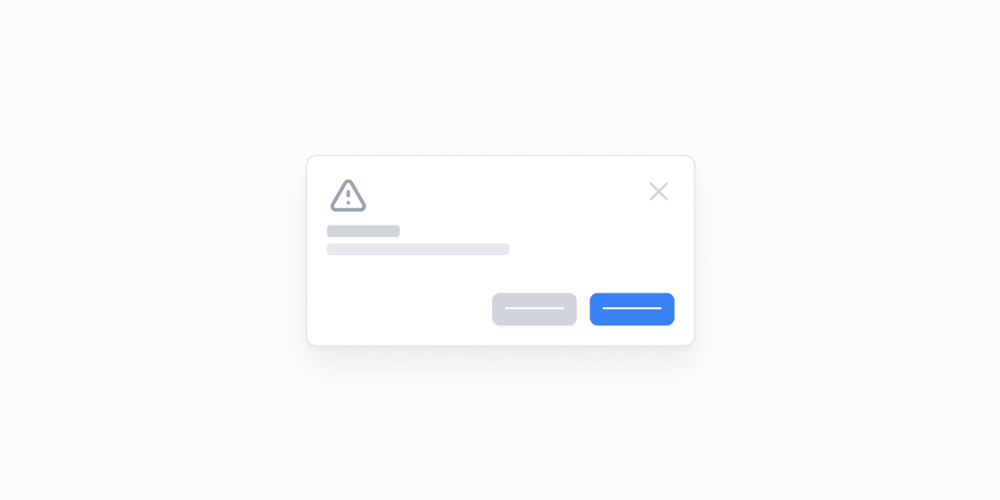

# Dialoglar — 9 ta blok

[← Toʻplam](../README.md) · papka: [`bloklar/dialogs/`](../bloklar/dialogs/)

Tasdiqlash va yaratish dialoglari. Demo: statik karta + tugma orqali haqiqiy `Dialog`. 09 — koʻp bosqichli `Drawer`.

**Ustozonaʼda:** Loyihada `ui/dialog`, `ui/alert-dialog`, `ui/drawer` bor — asosan matn va tartib uchun referens.

**Primitivlar** (nechta blokda): `Button` (9), `Card` (8), `Dialog` (8), `Divider` (8), `Input` (8), `Label` (8), `Select` (2), `Textarea` (2), `Switch` (1), `Drawer` (1), `RadioCardGroup` (1).

**Toʻsiqlar:** yoʻq — ikon va `tailwind-variants` almashtirilsa, loyiha paketlari bilan tip xatosiz.

| # | Koʻrinish | Primitivlar | Toʻsiq |
|---|---|---|---|
| [01](../bloklar/dialogs/dialog-01.tsx) | Egalikni oʻtkazish — parol bilan tasdiqlash | Card, Button, Dialog, Divider, Input, Label | — |
| [02](../bloklar/dialogs/dialog-02.tsx) | Oʻchirish (destructive) — parol bilan | Card, Button, Dialog, Divider, Input, Label | — |
| [03](../bloklar/dialogs/dialog-03.tsx) | Ikki bosqichli autentifikatsiyani oʻchirish: email + parol | Card, Button, Dialog, Divider, Input, Label | — |
| [04](../bloklar/dialogs/dialog-04.tsx) | Yaratish formasi: nom + Switchʼli sozlamalar | Card, Button, Dialog, Divider, Input, Label, Switch | — |
| [05](../bloklar/dialogs/dialog-05.tsx) | Aʼzolarni taklif qilish + mavjud kirish huquqi roʻyxati | Card, Button, Dialog, Divider, Input | — |
| [06](../bloklar/dialogs/dialog-06.tsx) | Ilova qoʻshish: ilova kartasi, tavsif, funksiyalar | Card, Button, Dialog, Divider, Label, Select | — |
| [07](../bloklar/dialogs/dialog-07.tsx) | Saqlangan soʻrov yaratish: nom + Textarea | Card, Button, Dialog, Divider, Input, Label, Textarea | — |
| [08](../bloklar/dialogs/dialog-08.tsx) | Majburiy maydonlar + rasm yuklash formasi | Card, Button, Dialog, Divider, Input, Label | — |
| [09](../bloklar/dialogs/dialog-09.tsx) | Koʻp bosqichli Drawer: 2 sahifa forma + xulosa | Button, Drawer, Input, Label, RadioCardGroup, Select, Textarea | — |
