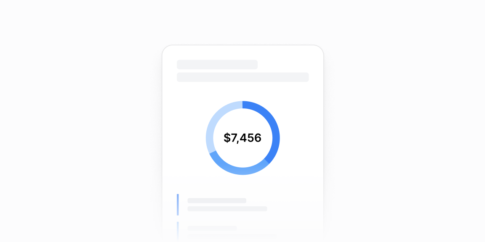

# Donut grafiklar — 7 ta blok

[← Toʻplam](../README.md) · papka: [`bloklar/donut-charts/`](../bloklar/donut-charts/)

Donut + kategoriya roʻyxati (summa / ulush), tabli variantlar va ichma-ich progress halqalari.

**Ustozonaʼda:** `CompletionDonutChart` / `GenderDonutChart` uchun 06/07 (donut + legenda roʻyxati); 02 — ichma-ich halqalar bilan umumiy ball («7.8/10»).

**Primitivlar** (nechta blokda): `Card` (6), `DonutChart` (6), `Tabs` (3), `ProgressCircle` (1).

**Toʻsiqlar:** recharts 3 — 6 — maʼnosi: [README, «Toʻsiq belgilari»](../README.md#toʻsiq-belgilari).

| # | Koʻrinish | Primitivlar | Toʻsiq |
|---|---|---|---|
| [01](../bloklar/donut-charts/donut-chart-01.tsx) | Donut + ostida kategoriya roʻyxati (summa / ulush) | Card, DonutChart | recharts 3 |
| [02](../bloklar/donut-charts/donut-chart-02.tsx) | Uchta ichma-ich ProgressCircle («7.8/10») + hududlar roʻyxati va subhudud qiymatlari (DonutChart emas) | Card, ProgressCircle | — |
| [03](../bloklar/donut-charts/donut-chart-03.tsx) | Tablar — har tabda donut + kategoriya roʻyxati | Card, DonutChart, Tabs | recharts 3 |
| [04](../bloklar/donut-charts/donut-chart-04.tsx) | 03 varianti: summa va ulush bir qatorda | Card, DonutChart, Tabs | recharts 3 |
| [05](../bloklar/donut-charts/donut-chart-05.tsx) | 03 varianti: roʻyxat qatorlari havola (›) | Card, DonutChart, Tabs | recharts 3 |
| [06](../bloklar/donut-charts/donut-chart-06.tsx) | Donut + yonida legenda roʻyxati (summa, ulush) — gorizontal | Card, DonutChart | recharts 3 |
| [07](../bloklar/donut-charts/donut-chart-07.tsx) | Kartasiz: donut markazida jami qiymat, legenda alohida kartochkalarda | DonutChart | recharts 3 |
