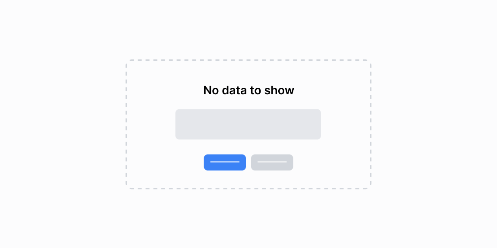

# Boʻsh holatlar — 10 ta blok

[← Toʻplam](../README.md) · papka: [`bloklar/empty-states/`](../bloklar/empty-states/)

Maʼlumot yoʻq holatlari: grafik kartasida ikon + matn, neytral progress, legenda bor-grafik yoʻq, xira grafik ustida overlay, placeholder toʻr ustida gradient.

**Ustozonaʼda:** `StatEmpty` bilan solishtiring: 08 (xira grafik + overlay) va 06 (legenda saqlanadi) statistika uchun eng mos.

**Primitivlar** (nechta blokda): `Card` (7), `Button` (5), `Tabs` (3), `ProgressCircle` (2), `AreaChart` (1).

**Toʻsiqlar:** recharts 3 — 1 — maʼnosi: [README, «Toʻsiq belgilari»](../README.md#toʻsiq-belgilari).

| # | Koʻrinish | Primitivlar | Toʻsiq |
|---|---|---|---|
| [01](../bloklar/empty-states/empty-state-01.tsx) | Grafik kartasida «No data to show» (ikon + izoh) | Card | — |
| [02](../bloklar/empty-states/empty-state-02.tsx) | 01 ning uslub varianti | Card | — |
| [03](../bloklar/empty-states/empty-state-03.tsx) | Boʻsh holat + «Add database» tugmasi | Card, Button | — |
| [04](../bloklar/empty-states/empty-state-04.tsx) | Sigʻim kartasi: nol qiymatli neytral ProgressCircleʼlar | Card, ProgressCircle | — |
| [05](../bloklar/empty-states/empty-state-05.tsx) | Budjet kartalari neytral ProgressCircle bilan + «Add budget limits» | Card, Button, ProgressCircle | — |
| [06](../bloklar/empty-states/empty-state-06.tsx) | Tabli karta: legenda qiymatlari bor, grafik oʻrnida boʻsh holat | Card, Tabs | — |
| [07](../bloklar/empty-states/empty-state-07.tsx) | Legenda + boʻsh holat va «Connect database» | Card, Button | — |
| [08](../bloklar/empty-states/empty-state-08.tsx) | Xira grafik (tooltipʼsiz) ustida boʻsh holat overlayʼi | AreaChart | recharts 3 |
| [09](../bloklar/empty-states/empty-state-09.tsx) | Dashboard sahifasi: tablar + funksiyani yoqish taklifi | Button, Tabs | — |
| [10](../bloklar/empty-states/empty-state-10.tsx) | Placeholder toʻr ustida gradient va «No reports created yet» + tugma | Button, Tabs | — |
