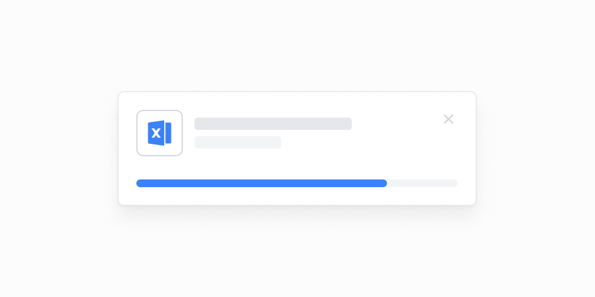

# Fayl yuklash — 7 ta blok

[← Toʻplam](../README.md) · papka: [`bloklar/file-upload/`](../bloklar/file-upload/)

Drag & drop maydoni va fayl holatlari: yuklanmoqda (%), tugallandi, bir nechta fayl, hajm xatosi, muvaffaqiyatsiz.

**Ustozonaʼda:** Ish reja importi (xlsx/docx) va sinflarni import qilish modallari uchun holat koʻrinishlari.

**Primitivlar** (nechta blokda): `Button` (6), `ProgressBar` (3), `Input` (2), `Label` (2), `Divider` (1), `SelectNative` (1).

**Toʻsiqlar:** yoʻq — ikon va `tailwind-variants` almashtirilsa, loyiha paketlari bilan tip xatosiz.

| # | Koʻrinish | Primitivlar | Toʻsiq |
|---|---|---|---|
| [01](../bloklar/file-upload/file-upload-01.tsx) | Nom + oddiy fayl input (CSV / XLSX) formasi | Button, Input, Label | — |
| [02](../bloklar/file-upload/file-upload-02.tsx) | `react-dropzone` bilan drag & drop, fayllar roʻyxati | Button, Divider, Input, Label, SelectNative | — |
| [03](../bloklar/file-upload/file-upload-03.tsx) | Drag & drop + yuklanayotgan fayl (ProgressBar 45%) | Button, ProgressBar | — |
| [04](../bloklar/file-upload/file-upload-04.tsx) | Yuklangan fayl «Completed» + Cancel / Continue | Button | — |
| [05](../bloklar/file-upload/file-upload-05.tsx) | Bir nechta fayl: «In Progress» va tugallanganlar | ProgressBar | — |
| [06](../bloklar/file-upload/file-upload-06.tsx) | Hajm oshgan xato ogohlantirishi | Button | — |
| [07](../bloklar/file-upload/file-upload-07.tsx) | «Failed» holati va xato izohi | Button, ProgressBar | — |
