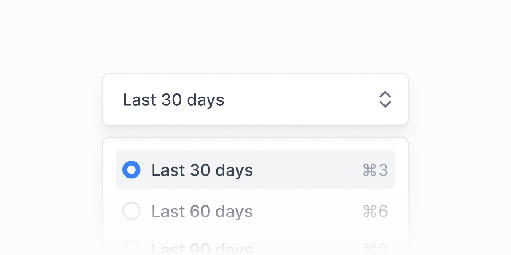

# Filtr panellari — 16 ta blok

[← Toʻplam](../README.md) · papka: [`bloklar/filterbar/`](../bloklar/filterbar/)

Select/DropdownMenu/Popover asosidagi filtr va almashtirgichlar: davr presetlari, segmentli davr tugmalari, DateRangePicker + filtrlar, ustunlarni koʻrsatish, ustun filtri (matn / son / checkbox).

**Ustozonaʼda:** `PeriodSelect` uchun 04/05 (segmentli davr) va 10 (preset dropdown). Admin roʻyxatlari: 11–13 (sana oraligʻi + shart filtri), 14–16 (ustun filtri). ⚠️ DateRangePicker (11–13) react-day-picker 8 ga yozilgan.

**Primitivlar** (nechta blokda): `Select` (9), `Label` (6), `Tooltip` (5), `Button` (5), `Popover` (5), `DropdownMenu` (4), `DatePicker` (3), `Input` (3), `Checkbox` (1).

**Toʻsiqlar:** react-day-picker 10 — 3, react-aria — 3 — maʼnosi: [README, «Toʻsiq belgilari»](../README.md#toʻsiq-belgilari).

| # | Koʻrinish | Primitivlar | Toʻsiq |
|---|---|---|---|
| [01](../bloklar/filterbar/filterbar-01.tsx) | Workspace Selectʼi: ikonli variantlar, hoverʼda yon Tooltip tavsifi, disabled variantlar | Select, Tooltip | — |
| [02](../bloklar/filterbar/filterbar-02.tsx) | Hisob almashtirish Selectʼi: guruh sarlavhasi, initsial avatarlar | Select | — |
| [03](../bloklar/filterbar/filterbar-03.tsx) | Grafik turi Selectʼi: hoverʼda Tooltip ichida grafik eskizi va tavsif | Select, Tooltip | — |
| [04](../bloklar/filterbar/filterbar-04.tsx) | Segmentli davr tugmalari — har birida sana Tooltipʼi | Tooltip | — |
| [05](../bloklar/filterbar/filterbar-05.tsx) | 04 + «XTD» Select; mobil va desktop uchun ikki joylashuv | Select, Tooltip | — |
| [06](../bloklar/filterbar/filterbar-06.tsx) | Split tugma: «Create Dashboard» + guruhlangan DropdownMenu | DropdownMenu | — |
| [07](../bloklar/filterbar/filterbar-07.tsx) | Ustunlarni koʻrsatish / yashirish tugmalari (Tooltip), tanlanganlar soni | DropdownMenu, Tooltip | — |
| [08](../bloklar/filterbar/filterbar-08.tsx) | DropdownMenu ichida saralash va sana radio guruhlari | DropdownMenu | — |
| [09](../bloklar/filterbar/filterbar-09.tsx) | «Display» DropdownMenu: xususiyatlarni checkbox bilan yoqish | — | — |
| [10](../bloklar/filterbar/filterbar-10.tsx) | Kalendar ikonli davr preset DropdownMenu («Last 30 days» …) | DropdownMenu | — |
| [11](../bloklar/filterbar/filterbar-11.tsx) | DateRangePicker + Country va Status Selectʼlari (Label bilan) | DatePicker, Label, Select | react-day-picker 10, react-aria |
| [12](../bloklar/filterbar/filterbar-12.tsx) | DateRangePicker + «Filter transactions» Popover (ichida shart formasi) | Button, DatePicker, Input, Label, Popover, Select | react-day-picker 10, react-aria |
| [13](../bloklar/filterbar/filterbar-13.tsx) | 12 + filtr soni nishoni | Button, DatePicker, Input, Label, Popover, Select | react-day-picker 10, react-aria |
| [14](../bloklar/filterbar/filterbar-14.tsx) | Ustun filtri Popoverʼda: variant tanlash (Select) | Button, Label, Popover, Select | — |
| [15](../bloklar/filterbar/filterbar-15.tsx) | Ustun filtri: son sharti (teng / katta / kichik / oraliq) | Button, Input, Label, Popover, Select | — |
| [16](../bloklar/filterbar/filterbar-16.tsx) | Ustun filtri: checkbox variantlar | Button, Checkbox, Label, Popover | — |
