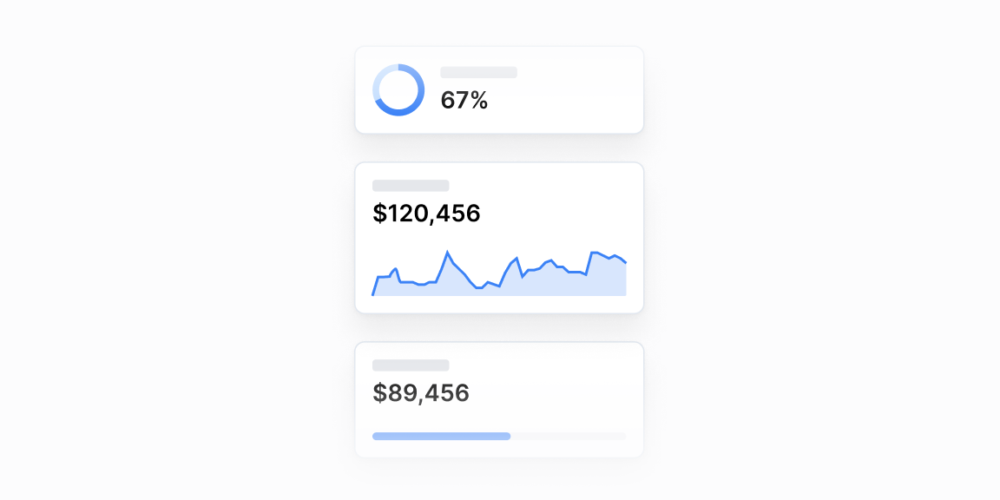

# KPI kartalar — 29 ta blok

[← Toʻplam](../README.md) · papka: [`bloklar/kpi-cards/`](../bloklar/kpi-cards/)

Bitta raqam atrofida qurilgan koʻrsatkich kartalari: oʻzgarish nishoni, oldingi davr bilan solishtirish, progress, taqsimot va trend. Aksariyati `grid sm:grid-cols-2 lg:grid-cols-3` toʻrida 3 ta karta chizadi.

**Ustozonaʼda:** `StatCard` allaqachon 06-blok naqshida qurilgan — 01–08, 15 koʻpincha unga prop qoʻshish bilan hal boʻladi. 10/11/29 — xavf darajasi (davomat, oʻzlashtirish), 21/25 — baho taqsimoti, 17–19 — oylik trend.

**Primitivlar** (nechta blokda): `Card` (29), `ProgressCircle` (4), `AreaChart` (3), `CategoryBar` (3), `ProgressBar` (2), `SparkChart` (1), `LineChart` (1).

**Toʻsiqlar:** recharts 3 — 4 — maʼnosi: [README, «Toʻsiq belgilari»](../README.md#toʻsiq-belgilari).

| # | Koʻrinish | Primitivlar | Toʻsiq |
|---|---|---|---|
| [01](../bloklar/kpi-cards/kpi-card-01.tsx) | Nom; katta raqam, yonida rangli foiz oʻzgarish (matn) | Card | — |
| [02](../bloklar/kpi-cards/kpi-card-02.tsx) | Nom + oʻng yuqorida oʻzgarish nishoni (fon + ring); pastda raqam | Card | — |
| [03](../bloklar/kpi-cards/kpi-card-03.tsx) | Teskari tartib: raqam tepada, oʻzgarish oʻngda, nom pastda | Card | — |
| [04](../bloklar/kpi-cards/kpi-card-04.tsx) | 01 kabi + pastki footerʼda «View more →» havolasi | Card | — |
| [05](../bloklar/kpi-cards/kpi-card-05.tsx) | Nom + oʻzgarish; raqam va «from {oldingi}» solishtirish | Card | — |
| [06](../bloklar/kpi-cards/kpi-card-06.tsx) | 02 ning strelkali varianti: nishon ichida ▲/▼ (`StatCard` shu asosda) | Card | — |
| [07](../bloklar/kpi-cards/kpi-card-07.tsx) | 05 + oʻzgarish nishonda (ring) | Card | — |
| [08](../bloklar/kpi-cards/kpi-card-08.tsx) | Raqam + «from oldingi»; pastda ▲/▼ foiz + «from previous month» | Card | — |
| [09](../bloklar/kpi-cards/kpi-card-09.tsx) | Chapda rangli vertikal chiziq; nom + oʻzgarish bir qatorda, raqam pastda | Card | — |
| [10](../bloklar/kpi-cards/kpi-card-10.tsx) | Raqam + holat nishoni (✓ within / 👁 observe / ⚠ critical) va normal diapazon | Card | — |
| [11](../bloklar/kpi-cards/kpi-card-11.tsx) | Raqam + pastda bosiluvchi qator: holat kvadrati, «3/5 goals», holat, › — butun karta havola | Card | — |
| [12](../bloklar/kpi-cards/kpi-card-12.tsx) | Sarlavha + tarif izohi; kartada ProgressCircle (%) + nom + «1 of 5 used» | Card, ProgressCircle | — |
| [13](../bloklar/kpi-cards/kpi-card-13.tsx) | ProgressCircle + «$250 / $1,000» + «Budget HR»; footer havola | Card, ProgressCircle | — |
| [14](../bloklar/kpi-cards/kpi-card-14.tsx) | Nom (ticker), qiymat, oʻzgarish (mutlaq + %), ostida yashil/qizil sparkline | Card, SparkChart | — |
| [15](../bloklar/kpi-cards/kpi-card-15.tsx) | Raqam, ProgressBar, ostida «9.96%» va «996 of 10,000» | Card, ProgressBar | — |
| [16](../bloklar/kpi-cards/kpi-card-16.tsx) | Rang legendasi (0–50 / 50–75 / 75–100); «91/100» + chegaraga qarab rangi oʻzgaradigan halqa | Card, ProgressCircle | — |
| [17](../bloklar/kpi-cards/kpi-card-17.tsx) | Qiymat + sana, ostida AreaChart; kursor grafik ustida yursa tepadagi qiymat shu nuqtaga almashadi | Card, AreaChart | recharts 3 |
| [18](../bloklar/kpi-cards/kpi-card-18.tsx) | 17 + oldingi nuqtaga nisbatan % oʻzgarish (kulrang nishon) | Card, AreaChart | recharts 3 |
| [19](../bloklar/kpi-cards/kpi-card-19.tsx) | 18 varianti: katta qiymat, % + mutlaq farq, yashil/qizil | Card, AreaChart | recharts 3 |
| [20](../bloklar/kpi-cards/kpi-card-20.tsx) | Raqam + birlik; roʻyxat: har qatorda ulush nishoni (%), nom, diapazon — qatorlar havola | Card | — |
| [21](../bloklar/kpi-cards/kpi-card-21.tsx) | Jami + ikki qismli CategoryBar + legenda (rang, qiymat, nom); 2 ustun | Card, CategoryBar | — |
| [22](../bloklar/kpi-cards/kpi-card-22.tsx) | Jami + har qism: nom, qiymat (%), ProgressBar (`lg` da bir qatorda); 2 ustun | Card, ProgressBar | — |
| [23](../bloklar/kpi-cards/kpi-card-23.tsx) | Panel: jami + koʻp qismli CategoryBar; ostida kichik bosiluvchi kartalar (rang, nom, ulush · summa, ↗) | Card, CategoryBar | — |
| [24](../bloklar/kpi-cards/kpi-card-24.tsx) | Ikonka (soyali quti) + nom; raqam + oʻzgarish; pastda «top-3» tarkib roʻyxati | Card | — |
| [25](../bloklar/kpi-cards/kpi-card-25.tsx) | Jami + 3 qismli CategoryBar + katta foizlar va legenda — 3 karta qoʻlda yozilgan | Card, CategoryBar | — |
| [26](../bloklar/kpi-cards/kpi-card-26.tsx) | Chapda ikki koʻrsatkich (legenda + katta %), oʻngda katta ProgressCircle | Card, ProgressCircle | — |
| [27](../bloklar/kpi-cards/kpi-card-27.tsx) | Chapda ikki qiymat (bugun / kecha), oʻngda ikki chiziqli LineChart | Card, LineChart | recharts 3 |
| [28](../bloklar/kpi-cards/kpi-card-28.tsx) | Keng panel (5+3 ustun): 9 koʻrsatkich toʻri (qiymat + %) va raqamlangan «Top Issues» roʻyxati | Card | — |
| [29](../bloklar/kpi-cards/kpi-card-29.tsx) | Gorizontal koʻrsatkichlar: 3 chiziqli «signal» indikatori (qizil / toʻq sariq / yashil), foiz va kasr | Card | — |
