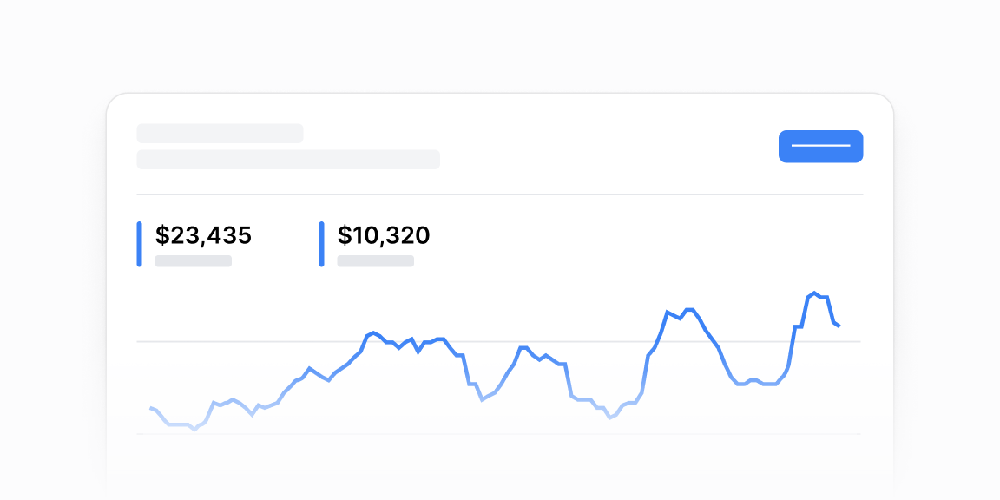

# Chiziqli grafiklar — 12 ta blok

[← Toʻplam](../README.md) · papka: [`bloklar/line-charts/`](../bloklar/line-charts/)

Chiziqli grafiklar: koʻp seriya + legenda-roʻyxat, oy boshidan kumulyativ, chegara chizigʻi, sana oraligʻi filtri, metrika kartalari toʻri.

**Ustozonaʼda:** 05 — AI kvota: oy boshidan kumulyativ sarf + «limit» chizigʻi. 04 — joriy oy vs oʻtgan oy. 11 — admin metrika toʻri (Badge bilan oʻzgarish).

**Primitivlar** (nechta blokda): `Card` (11), `LineChart` (9), `Button` (2), `Divider` (2), `Tabs` (1), `DatePicker` (1), `Select` (1), `Badge` (1).

**Toʻsiqlar:** recharts 3 — 12, react-day-picker 10 — 1, react-aria — 1 — maʼnosi: [README, «Toʻsiq belgilari»](../README.md#toʻsiq-belgilari).

| # | Koʻrinish | Primitivlar | Toʻsiq |
|---|---|---|---|
| [01](../bloklar/line-charts/line-chart-01.tsx) | 3 kanalli chiziq grafik + legenda (qiymatlar bilan) | Card, LineChart | recharts 3 |
| [02](../bloklar/line-charts/line-chart-02.tsx) | Aksiya narxi: narx, 24 soatlik oʻzgarish, chiziq; ostida 2 ustunli koʻrsatkichlar | Card, LineChart | recharts 3 |
| [03](../bloklar/line-charts/line-chart-03.tsx) | 3 shahar chiziqlari + ostida joylashuvlar roʻyxati (turi, manzil, oʻzgarish, jami) | Card, LineChart | recharts 3 |
| [04](../bloklar/line-charts/line-chart-04.tsx) | Oy boshidan kumulyativ: joriy oy vs oʻtgan oy, oxirgi nuqta ajratilgan; LineChart fayl ichida moslangan | Card | recharts 3 |
| [05](../bloklar/line-charts/line-chart-05.tsx) | 04 + gorizontal chegara chizigʻi (`referenceLine` «Usage limit») | Card | recharts 3 |
| [06](../bloklar/line-charts/line-chart-06.tsx) | Portfel: qiymat + oʻzgarish, davr tablari, 2 seriya; pastda xulosa roʻyxati | Card, LineChart, Tabs | recharts 3 |
| [07](../bloklar/line-charts/line-chart-07.tsx) | 3 seriyali solishtiruv; yonida legenda-roʻyxat + «Compare asset» tugmasi | Card, LineChart | recharts 3 |
| [08](../bloklar/line-charts/line-chart-08.tsx) | 07 ning ikki kartali varianti (grafik va roʻyxat alohida) | Card, LineChart | recharts 3 |
| [09](../bloklar/line-charts/line-chart-09.tsx) | DateRangePicker bilan grafik maʼlumoti filtrlanadi + «Reset» tugmasi | Button, DatePicker, LineChart | recharts 3, react-day-picker 10, react-aria |
| [10](../bloklar/line-charts/line-chart-10.tsx) | Filtr paneli (2 Select + «Download report»); ostida metrika kartalari — har birida mini chiziq | Card, Button, Divider, LineChart, Select | recharts 3 |
| [11](../bloklar/line-charts/line-chart-11.tsx) | Metrika kartalari toʻri: nom + Badge (success / error), qiymat, «Compared to …», mini chiziq | Card, Badge, Divider, LineChart | recharts 3 |
| [12](../bloklar/line-charts/line-chart-12.tsx) | 3 seriyali soʻrovlar sharhi, `autoMinValue`; LineChart fayl ichida moslangan | Card | recharts 3 |
