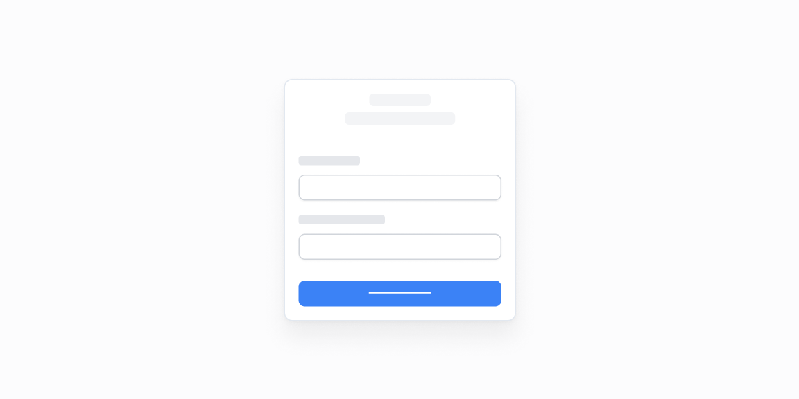

# Kirish sahifalari — 10 ta blok

[← Toʻplam](../README.md) · papka: [`bloklar/logins/`](../bloklar/logins/)

Kirish / roʻyxatdan oʻtish ekranlari: email, parol, OAuth tugmalari, ikki ustunli va animatsion fonli variantlar.

**Ustozonaʼda:** Auth sahifalari allaqachon bor — faqat vizual gʻoya uchun.

**Primitivlar** (nechta blokda): `Button` (10), `Input` (9), `Label` (9), `Divider` (6), `Card` (1), `Checkbox` (1).

**Toʻsiqlar:** yoʻq — ikon va `tailwind-variants` almashtirilsa, loyiha paketlari bilan tip xatosiz.

| # | Koʻrinish | Primitivlar | Toʻsiq |
|---|---|---|---|
| [01](../bloklar/logins/login-01.tsx) | Email + «Sign in», Google bilan kirish | Button, Divider, Input, Label | — |
| [02](../bloklar/logins/login-02.tsx) | Email + parol + Google | Button, Divider, Input, Label | — |
| [03](../bloklar/logins/login-03.tsx) | «Welcome back» — email / parol | Button, Input, Label | — |
| [04](../bloklar/logins/login-04.tsx) | Logo, «Sign up» havolasi, GitHub / Google + forma | Button, Divider, Input, Label | — |
| [05](../bloklar/logins/login-05.tsx) | Kartadagi roʻyxatdan oʻtish formasi | Card, Button, Checkbox, Input, Label | — |
| [06](../bloklar/logins/login-06.tsx) | Ikki ustunli kirish sahifasi | Button, Input, Label | — |
| [07](../bloklar/logins/login-07.tsx) | Fonda niqoblangan katak naqsh + forma | Button | — |
| [08](../bloklar/logins/login-08.tsx) | Fonda tasodifiy yonib-oʻchadigan kataklar + forma | Button, Divider, Input, Label | — |
| [09](../bloklar/logins/login-09.tsx) | Ikki panelli «Get started now» | Button, Divider, Input, Label | — |
| [10](../bloklar/logins/login-10.tsx) | 09 + elementlarning ketma-ket paydo boʻlishi | Button, Divider, Input, Label | — |
