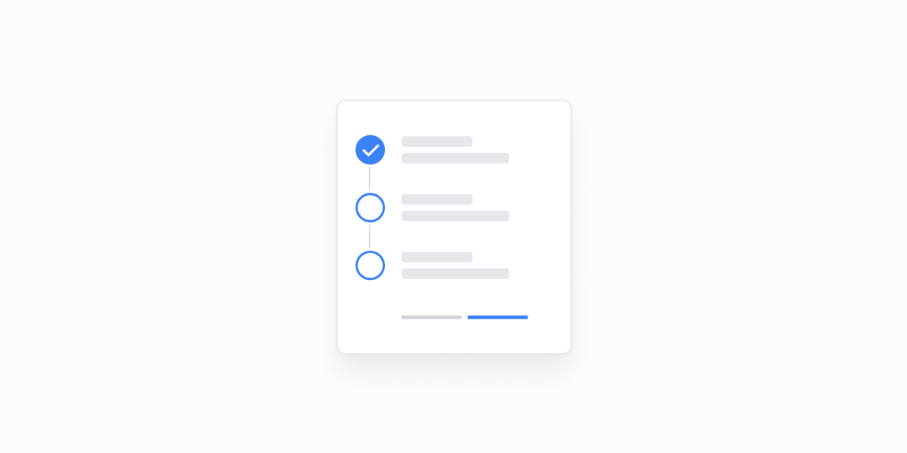

# Onboarding va lenta — 16 ta blok

[← Toʻplam](../README.md) · papka: [`bloklar/onboarding-feed/`](../bloklar/onboarding-feed/)

Sozlash qadamlari, progress, Accordion qadamlar, faoliyat timelineʼi, deploy pipeline, savolnoma ekranlari (animatsiyali kirish bilan).

**Ustozonaʼda:** 05/06 — admin audit / faoliyat lentasi; 01/03 — yangi oʻqituvchi uchun «birinchi qadamlar» roʻyxati.

**Primitivlar** (nechta blokda): `Button` (12), `Card` (5), `RadioCardGroup` (5), `Label` (4), `Input` (3), `ProgressBar` (2), `Accordion` (2), `Tabs` (2), `Badge` (2), `Divider` (2), `Checkbox` (1), `Switch` (1).

**Toʻsiqlar:** yoʻq — ikon va `tailwind-variants` almashtirilsa, loyiha paketlari bilan tip xatosiz.

| # | Koʻrinish | Primitivlar | Toʻsiq |
|---|---|---|---|
| [01](../bloklar/onboarding-feed/onboarding-feed-01.tsx) | Salomlashish + qadamlar: bajarilgan (✓), jarayonda (tugma bilan), kutilayotgan | Button | — |
| [02](../bloklar/onboarding-feed/onboarding-feed-02.tsx) | Raqamlangan qadamlar + Back / Continue | Button | — |
| [03](../bloklar/onboarding-feed/onboarding-feed-03.tsx) | «Step 1/N» ProgressBar + qadamlar + yordam bloki | ProgressBar | — |
| [04](../bloklar/onboarding-feed/onboarding-feed-04.tsx) | Qadamlar Accordionʼda | Accordion, Button | — |
| [05](../bloklar/onboarding-feed/onboarding-feed-05.tsx) | Faoliyat timelineʼi: initsial, amal, vaqt | — | — |
| [06](../bloklar/onboarding-feed/onboarding-feed-06.tsx) | Sozlash timelineʼi: done / in progress / pending belgilari | — | — |
| [07](../bloklar/onboarding-feed/onboarding-feed-07.tsx) | 06 + kartada tablar va «Notify» tugmasi | Card, Button, Tabs | — |
| [08](../bloklar/onboarding-feed/onboarding-feed-08.tsx) | 07 + foydalanuvchi profili | Card, Button, Tabs | — |
| [09](../bloklar/onboarding-feed/onboarding-feed-09.tsx) | Pipeline: har bosqich ProgressBar + holat; Accordionʼda loglar | Accordion, ProgressBar | — |
| [10](../bloklar/onboarding-feed/onboarding-feed-10.tsx) | Savol ekrani: radio kartalar, animatsiyali kirish | Button, RadioCardGroup | — |
| [11](../bloklar/onboarding-feed/onboarding-feed-11.tsx) | Kategoriyalarni checkbox kartalar bilan tanlash | Card, Badge, Button, Checkbox, Label | — |
| [12](../bloklar/onboarding-feed/onboarding-feed-12.tsx) | Maket turini tanlash (jadval / toʻr / roʻyxat namunasi bilan) | Button, RadioCardGroup | — |
| [13](../bloklar/onboarding-feed/onboarding-feed-13.tsx) | Integratsiyalarni ulash: Connect → Connecting → Done | Badge, Button | — |
| [14](../bloklar/onboarding-feed/onboarding-feed-14.tsx) | Koʻp qadamli forma (1-qadam): radio kartalar + Switch | Card, Button, Input, Label, RadioCardGroup, Switch | — |
| [15](../bloklar/onboarding-feed/onboarding-feed-15.tsx) | Savolnoma: lavozim va soha RadioCardGroupʼlari | Button, Divider, Input, Label, RadioCardGroup | — |
| [16](../bloklar/onboarding-feed/onboarding-feed-16.tsx) | 15 ning kartaga oʻralgan varianti | Card, Button, Divider, Input, Label, RadioCardGroup | — |
