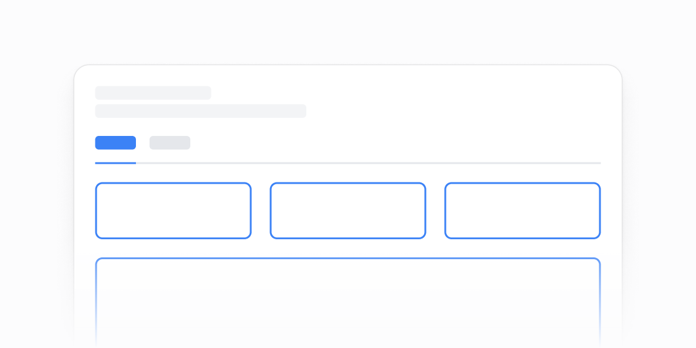

# Sahifa karkaslari — 6 ta blok

[← Toʻplam](../README.md) · papka: [`bloklar/page-shells/`](../bloklar/page-shells/)

Kontent oʻrnida `ContentPlaceholder` (shtrixlangan quti) turgan sahifa skeletlari: sarlavha + filtrlar + tablar, yuqori navigatsiya, hisobotlar roʻyxati.

**Ustozonaʼda:** Yangi statistika yoki admin sahifasini loyihalashda joylashuv eskizi sifatida (01, 03).

**Primitivlar** (nechta blokda): `Card` (6), `SelectNative` (3), `Button` (3), `Accordion` (2), `Select` (1), `Tabs` (1), `Divider` (1), `Input` (1).

**Toʻsiqlar:** yoʻq — ikon va `tailwind-variants` almashtirilsa, loyiha paketlari bilan tip xatosiz.

| # | Koʻrinish | Primitivlar | Toʻsiq |
|---|---|---|---|
| [01](../bloklar/page-shells/page-shell-01.tsx) | Hisobot sahifasi: sarlavha + davr / hudud Selectʼlari, tablar, placeholder kontent | Card, Select, Tabs | — |
| [02](../bloklar/page-shells/page-shell-02.tsx) | 01 varianti (SelectNative, KPI placeholder kartalari) | Card, Divider, SelectNative | — |
| [03](../bloklar/page-shells/page-shell-03.tsx) | Yuqori navigatsiya (logo + tab havolalar) + filtrlar va placeholder panellar | Card, SelectNative | — |
| [04](../bloklar/page-shells/page-shell-04.tsx) | Hisobotlar roʻyxati: «Add report», qidiruv, Accordion (Recent / All) ichida karta toʻri | Card, Accordion, Button, Input | — |
| [05](../bloklar/page-shells/page-shell-05.tsx) | 04 + tepada ikki havola-kartochka | Card, Accordion, Button | — |
| [06](../bloklar/page-shells/page-shell-06.tsx) | 05 + saralash SelectNative | Card, Button, SelectNative | — |
