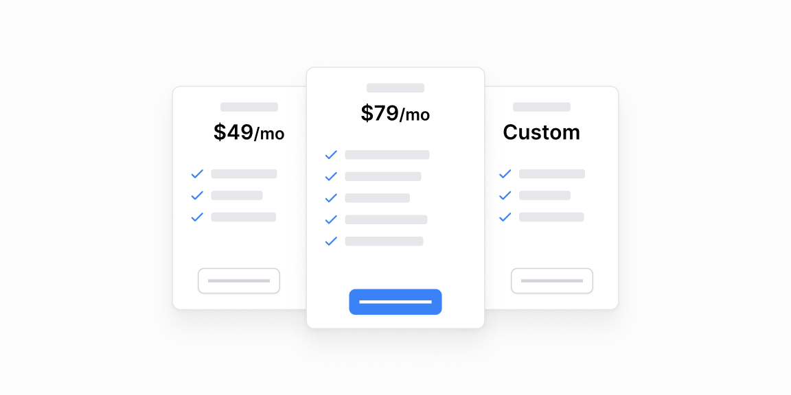

# Tarif boʻlimlari — 8 ta blok

[← Toʻplam](../README.md) · papka: [`bloklar/pricing-sections/`](../bloklar/pricing-sections/)

Tarif kartalari, oylik/yillik almashtirgich, funksiya roʻyxatlari va toʻliq narxlar sahifasi.

**Ustozonaʼda:** Landing / obuna sahifasi uchun.

**Primitivlar** (nechta blokda): `Button` (8), `Divider` (3), `Badge` (3), `Label` (3), `Switch` (2), `RadioCardGroup` (1), `Tooltip` (1).

**Toʻsiqlar:** yoʻq — ikon va `tailwind-variants` almashtirilsa, loyiha paketlari bilan tip xatosiz.

| # | Koʻrinish | Primitivlar | Toʻsiq |
|---|---|---|---|
| [01](../bloklar/pricing-sections/pricing-section-01.tsx) | «Unlock all features» + havola-kartochkalar | Button, Divider | — |
| [02](../bloklar/pricing-sections/pricing-section-02.tsx) | Tarif kartalari: badge, qoʻshimcha narx, funksiyalar | Badge, Button | — |
| [03](../bloklar/pricing-sections/pricing-section-03.tsx) | 01 varianti | Badge, Button, Divider, Label, RadioCardGroup | — |
| [04](../bloklar/pricing-sections/pricing-section-04.tsx) | Tarif kartalari: tavsiya belgisi, narx, tugma, funksiyalar | Button | — |
| [05](../bloklar/pricing-sections/pricing-section-05.tsx) | Oylik / yillik almashtirgich + tarif kartalari | Badge, Button | — |
| [06](../bloklar/pricing-sections/pricing-section-06.tsx) | Faol / nofaol funksiya belgilari (✓ / ×) bilan kartalar | Button, Divider | — |
| [07](../bloklar/pricing-sections/pricing-section-07.tsx) | Toʻliq narxlar sahifasi: almashtirgich, kartalar, solishtirish | Button, Label, Switch | — |
| [08](../bloklar/pricing-sections/pricing-section-08.tsx) | 07 varianti | Button, Label, Switch, Tooltip | — |
