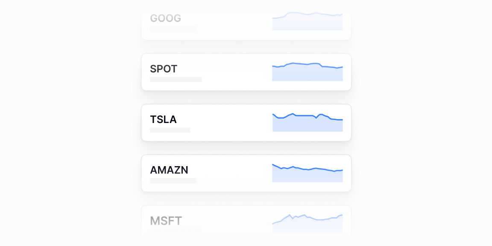

# Sparkline kartalar — 6 ta blok

[← Toʻplam](../README.md) · papka: [`bloklar/spark-charts/`](../bloklar/spark-charts/)

Kichik trend chizigʻi (sparkline) bilan kartalar va roʻyxatlar. Yagona kategoriya — hammasi React 19 + recharts 3 bilan tip xatosiz.

**Ustozonaʼda:** Sinflar roʻyxatida har sinf yonida trend (02/03), dashboard KPI toʻri (04–06). `ui/sparkline` bilan solishtiring.

**Primitivlar** (nechta blokda): `Card` (6), `SparkChart` (6), `Tabs` (1).

**Toʻsiqlar:** yoʻq — ikon va `tailwind-variants` almashtirilsa, loyiha paketlari bilan tip xatosiz.

| # | Koʻrinish | Primitivlar | Toʻsiq |
|---|---|---|---|
| [01](../bloklar/spark-charts/spark-chart-01.tsx) | Kartalar toʻri: ticker, tavsif, sparkline (yashil / qizil), qiymat va oʻzgarish | Card, SparkChart | — |
| [02](../bloklar/spark-charts/spark-chart-02.tsx) | Watchlist kartasi: jami + oʻzgarish, roʻyxat qatorlarida sparkline | Card, SparkChart | — |
| [03](../bloklar/spark-charts/spark-chart-03.tsx) | 02 + tablar | Card, SparkChart, Tabs | — |
| [04](../bloklar/spark-charts/spark-chart-04.tsx) | Kartalar: nom, qiymat va yonida sparkline | Card, SparkChart | — |
| [05](../bloklar/spark-charts/spark-chart-05.tsx) | Kartalar: nom + oʻzgarish, keng rangli sparkline | Card, SparkChart | — |
| [06](../bloklar/spark-charts/spark-chart-06.tsx) | 05 + tavsif matni | Card, SparkChart | — |
