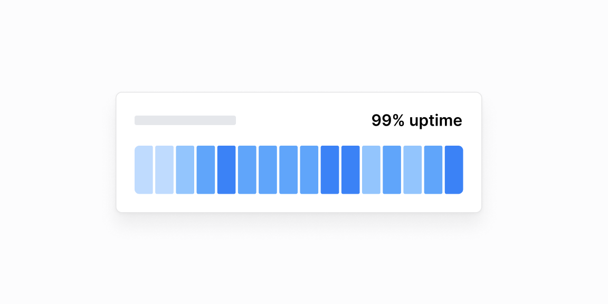

# Holat monitoringi — 10 ta blok

[← Toʻplam](../README.md) · papka: [`bloklar/status-monitoring/`](../bloklar/status-monitoring/)

`Tracker` (kunlik holat chiziqchalari) asosidagi uptime kartalari va holat sahifalari. Mobilda 90 kun oʻrniga 60/30 kun koʻrsatiladi.

**Ustozonaʼda:** Admin: tizim holati (Telegram webhook, pg_cron, AI provayder). Oʻquvchi davomati «90 kunlik chiziq» koʻrinishida ham ishlatilishi mumkin (01).

**Primitivlar** (nechta blokda): `Card` (10), `Tracker` (7), `Accordion` (2).

**Toʻsiqlar:** yoʻq — ikon va `tailwind-variants` almashtirilsa, loyiha paketlari bilan tip xatosiz.

| # | Koʻrinish | Primitivlar | Toʻsiq |
|---|---|---|---|
| [01](../bloklar/status-monitoring/tracker-01.tsx) | Uptime kartasi: nom, «Operational», 99.9%, 90 kunlik Tracker (mobilda 60/30) + vaqt shkalasi | Card, Tracker | — |
| [02](../bloklar/status-monitoring/tracker-02.tsx) | 01 + «Show details» bilan ochiladigan hodisa tavsifi | Card, Tracker | — |
| [03](../bloklar/status-monitoring/tracker-03.tsx) | Skanerlash holati: teglar, Tracker, «Running / Next run» | Card, Tracker | — |
| [04](../bloklar/status-monitoring/tracker-04.tsx) | 01 + legenda (Operational / Downtime / Maintenance) va uzilishlar roʻyxati | Card, Tracker | — |
| [05](../bloklar/status-monitoring/tracker-05.tsx) | 04, uzilishlar Accordion ichida | Card, Accordion, Tracker | — |
| [06](../bloklar/status-monitoring/tracker-06.tsx) | Kompakt: holat, sarlavha, teglar (hudud, sync, oxirgi ishga tushish) + Tracker | Card, Tracker | — |
| [07](../bloklar/status-monitoring/tracker-07.tsx) | Holat sahifasi: bir nechta sayt Accordionʼda, har birida Tracker | Card, Accordion, Tracker | — |
| [08](../bloklar/status-monitoring/tracker-08.tsx) | «All services are online»: bir nechta xizmat, har birida uptime % va Tracker | Card | — |
| [09](../bloklar/status-monitoring/tracker-09.tsx) | 08 varianti | Card | — |
| [10](../bloklar/status-monitoring/tracker-10.tsx) | 08 + Tracker hover effekti | Card | — |
