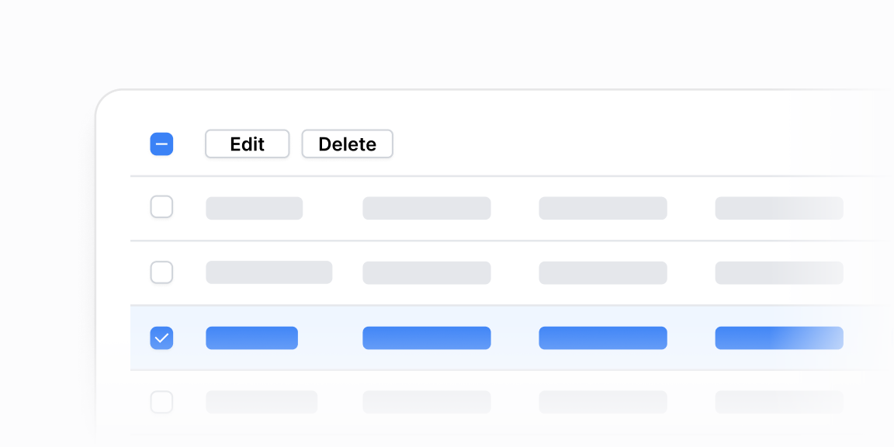

# Jadval amallari — 11 ta blok

[← Toʻplam](../README.md) · papka: [`bloklar/table-actions/`](../bloklar/table-actions/)

`@tanstack/react-table` asosida: saralash (3 xil strelka), qator tanlash, jami qatori, bulk-amallar (pastki panel, sarlavhada, hoverʼda, suzuvchi buyruq paneli), RadioCard filtr.

**Ustozonaʼda:** Admin: foydalanuvchilar / maktablar roʻyxatida tanlab amal bajarish (06, 10). Statistika: `ClassesTable` / `StudentsTable` saralash (01–03). ⚠️ `@tanstack/react-table` loyihada yoʻq.

**Primitivlar** (nechta blokda): `Table` (11), `Checkbox` (7), `Button` (3), `RadioCardGroup` (1).

**Toʻsiqlar:** tanstack — 11 — maʼnosi: [README, «Toʻsiq belgilari»](../README.md#toʻsiq-belgilari).

| # | Koʻrinish | Primitivlar | Toʻsiq |
|---|---|---|---|
| [01](../bloklar/table-actions/table-action-01.tsx) | Saralanadigan sarlavhalar (▲▼ ikkalasi), `aria-sort`, Enter bilan | Table | tanstack |
| [02](../bloklar/table-actions/table-action-02.tsx) | Saralash — faqat faol yoʻnalish strelkasi | Table | tanstack |
| [03](../bloklar/table-actions/table-action-03.tsx) | Saralash — toʻldirilgan ▲▼ | Table | tanstack |
| [04](../bloklar/table-actions/table-action-04.tsx) | Qator tanlash (checkbox; qator bosilsa tanlanadi), tanlangan qator chap chiziq bilan | Checkbox, Table | tanstack |
| [05](../bloklar/table-actions/table-action-05.tsx) | 04 + `TableFoot`: hammasini tanlash va «N of M selected» | Checkbox, Table | tanstack |
| [06](../bloklar/table-actions/table-action-06.tsx) | 05 + tanlanganda pastki panel: «Bulk edit» / «Delete all» | Button, Checkbox, Table | tanstack |
| [07](../bloklar/table-actions/table-action-07.tsx) | 05 + tanlanganda sarlavha qatorida bulk tugmalar | Button, Checkbox, Table | tanstack |
| [08](../bloklar/table-actions/table-action-08.tsx) | 05 + qator hoverʼda oxirgi ustunda Edit / Delete | Button, Checkbox, Table | tanstack |
| [09](../bloklar/table-actions/table-action-09.tsx) | 05 + qator hoverʼda ikonli amallar (tahrir, qoʻshish, oʻchirish) | Checkbox, Table | tanstack |
| [10](../bloklar/table-actions/table-action-10.tsx) | 05 + suzuvchi buyruq paneli klaviatura yorliqlari bilan (Edit — E, Delete — ⌘D) | Checkbox, Table | tanstack |
| [11](../bloklar/table-actions/table-action-11.tsx) | RadioCardGroup holat filtri (har kartada soni) + saralanadigan jadval | RadioCardGroup, Table | tanstack |
