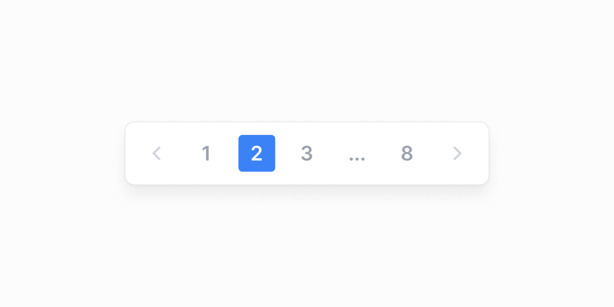

# Jadval sahifalash — 8 ta blok

[← Toʻplam](../README.md) · papka: [`bloklar/table-pagination/`](../bloklar/table-pagination/)

`@tanstack/react-table` sahifalash: «Page X of Y», «Showing 1–8 of N», birinchi/oxirgi sahifa, raqamli (1 2 … N) + mobil variant.

**Ustozonaʼda:** Admin foydalanuvchilar, audit, fikr-mulohaza roʻyxatlari. ⚠️ `@tanstack/react-table` loyihada yoʻq — `ui/pagination` bilan solishtiring.

**Primitivlar** (nechta blokda): `Table` (8).

**Toʻsiqlar:** tanstack — 8 — maʼnosi: [README, «Toʻsiq belgilari»](../README.md#toʻsiq-belgilari).

| # | Koʻrinish | Primitivlar | Toʻsiq |
|---|---|---|---|
| [01](../bloklar/table-pagination/pagination-01.tsx) | «Page X of Y» + Previous / Next ikon tugmalari | Table | tanstack |
| [02](../bloklar/table-pagination/pagination-02.tsx) | «Page X / Y» + yopishgan tugma guruhi | Table | tanstack |
| [03](../bloklar/table-pagination/pagination-03.tsx) | «Showing 1–8 of N» + Previous / Next | Table | tanstack |
| [04](../bloklar/table-pagination/pagination-04.tsx) | Birinchi / oldingi / keyingi / oxirgi sahifa tugmalari | Table | tanstack |
| [05](../bloklar/table-pagination/pagination-05.tsx) | Raqamli sahifalash (1 2 3 … N) + matnli Previous / Next; mobilda soddalashadi | Table | tanstack |
| [06](../bloklar/table-pagination/pagination-06.tsx) | 05 varianti (mobil tugmalar yopishgan) | Table | tanstack |
| [07](../bloklar/table-pagination/pagination-07.tsx) | 05 / 06 uslub varianti | Table | tanstack |
| [08](../bloklar/table-pagination/pagination-08.tsx) | Raqamli sahifalash `Button` bilan | Table | tanstack |
