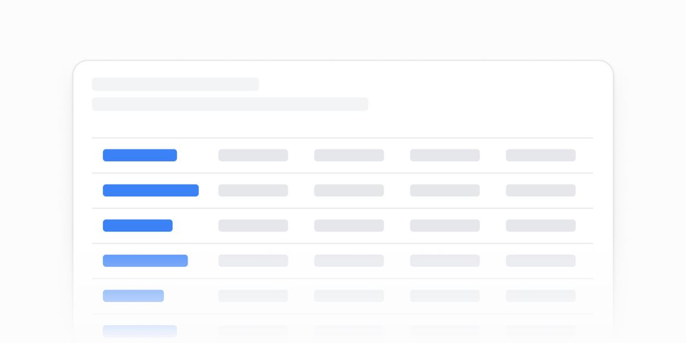

# Jadvallar — 11 ta blok

[← Toʻplam](../README.md) · papka: [`bloklar/tables/`](../bloklar/tables/)

`Table` primitivi ustidagi oddiy jadvallar: zebra, sticky sarlavha, holat/sigʻim vizuali, jami qatori, Select filtrlar, qatordagi sparkline, tarif solishtirish, kohort issiqlik xaritasi.

**Ustozonaʼda:** 11 — kohort retention issiqlik xaritasi: `TopicStudentMatrixCard` (mavzu × oʻquvchi) uchun tayyor naqsh. 09 — har qatorda trend. 07/08 — admin roʻyxatlarida filtr.

**Primitivlar** (nechta blokda): `Table` (10), `Button` (8), `ProgressCircle` (1), `SelectNative` (1), `Select` (1), `SparkChart` (1), `Tooltip` (1), `Divider` (1).

**Toʻsiqlar:** yoʻq — ikon va `tailwind-variants` almashtirilsa, loyiha paketlari bilan tip xatosiz.

| # | Koʻrinish | Primitivlar | Toʻsiq |
|---|---|---|---|
| [01](../bloklar/tables/table-01.tsx) | Oddiy jadval: sarlavha, tavsif, «Add workspace»; 7 ustun | Button, Table | — |
| [02](../bloklar/tables/table-02.tsx) | 01 + zebra qatorlar | Button, Table | — |
| [03](../bloklar/tables/table-03.tsx) | Sticky sarlavha qatori (scrollʼda yopishadi) | Button, Table | — |
| [04](../bloklar/tables/table-04.tsx) | Holat ustuni rangli belgi bilan | Button, Table | — |
| [05](../bloklar/tables/table-05.tsx) | Sigʻim ustunida kichik ProgressCircle (chegaraga qarab rang) | Button, ProgressCircle, Table | — |
| [06](../bloklar/tables/table-06.tsx) | 01 + `TableFoot` (jami qatori) | Button, Table | — |
| [07](../bloklar/tables/table-07.tsx) | SelectNative bilan holat filtri | Button, SelectNative, Table | — |
| [08](../bloklar/tables/table-08.tsx) | Ikkita Select (holat, egasi) bilan filtr | Select, Table | — |
| [09](../bloklar/tables/table-09.tsx) | Qoʻshimcha ustun: har qatorda SparkAreaChart | Button, SparkChart, Table | — |
| [10](../bloklar/tables/table-10.tsx) | Tarif solishtirish jadvali: boʻlimlar, Tooltip izohlar, ✓ belgilari (xom `<table>`) | Tooltip | — |
| [11](../bloklar/tables/table-11.tsx) | Kohort retention: haftalar boʻyicha foiz kataklari (issiqlik xaritasi), kohort hajmi | Divider, Table | — |
